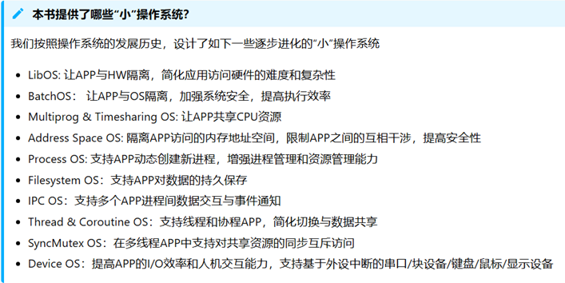
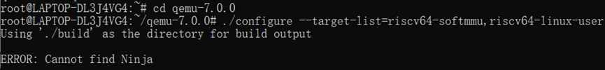
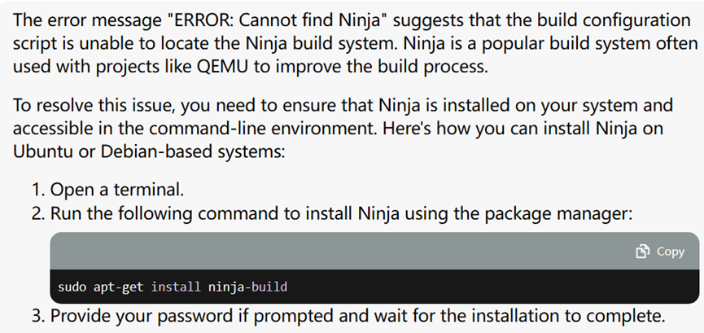
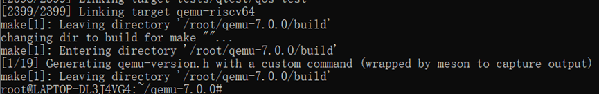
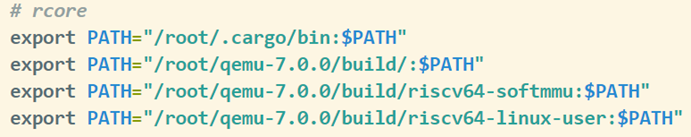
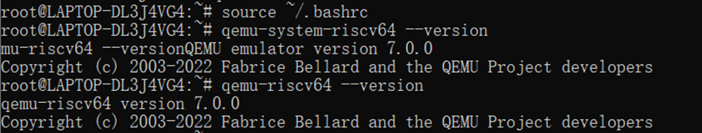
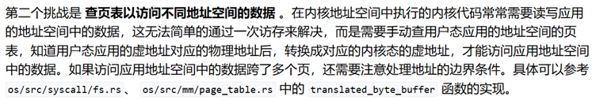

# rCore-Tutorial-Guide-2024S通关札记

## 前言
之前在学习操作系统的文件系统部分时，被国内的部分课本深深“恶心”到了，有幸阅读OSTEP以及一些其他的国外著作（如Unix Internals）并走了许多弯路后我发现一个问题：对于初学者来说，操作系统这种非常“工程类”的学科，（入门/初级阶段）应该采取的正确学习思路是用“增量法”，具体来说：就是从一个具有最基础功能的操作系统出发，不断分析现有问题、解决问题从而实现功能上的完善（即增量），这也是符合操作系统发展的历史脉络的。好巧不巧的是，rcore采取的正是这种教学策略：

要是能早点遇到该多好☹…

## 文档
rcore的文档非常之详细（对比xv6/pintos等），初学者很容易陷入到细节中去，因此在阅读文档/代码前建议先看一下每章的引言（相当于论文的abstract），明确每章要干什么以及代码的大致框架

## 环境配置
我自己采用的是（之前别的实验就配置好的）wsl2+ubuntu18.04+vscode+git，具体操作步骤文档内容写的很详细，网上也有很多相关教程

### 18.04安装qemu7.0.0
根据文档一步步操作至：出现报错


 
sudo apt-get install ninja-build
随后继续按照文档操作
最终：

在bashrc文件中配置路径：



### 其余部分根据指导书操作即可

## rust语言
不建议花费太多时间，个人感觉比较靠谱的策略就是“迅速掌握一门语言的50%”，剩下的内容现学现用（按需调用）
重点：所有权和生命周期、类型系统
推荐资料：rust语言圣经、清华rust课程ppt

## ci-user本地测试
在确定好思路后一定要看一下测试代码再动手coding，有些测试并没有覆盖所有情况，因此一些特别繁琐的情况可以忽略掉（不是本次实验的重点）

## 技能点
锻炼自己快速上手工程类代码的能力

## ch3-lab1
``` rust
struct TaskInfo {
    status: TaskStatus,
    syscall_times: [u32; MAX_SYSCALL_NUM],
    time: usize
}
```
任务：新增系统调用sys_task_info

分析：sys_task_info本质上是对参数中用户程序传入的指针指向的结构体赋值，因此本次实验的核心围绕这些值展开，需要思考的点就是：这些值要存放在什么地方？什么时候初始化？什么时候更新？为了获取这些值需要设计几个函数，这些函数哪些只能内部使用哪些是开放接口？

具体思维过程：
1. 只存储最原始的数据，也就是在`tcb`中存储`syscall_times`以及进程首次被调度的时间`start_time`，在需要时再将他们拼装成`TaskInfo`
2. 变量初始化时机：`tcb`初始化
3. 变量更新时机：所有系统调用中，更新对应的`syscall_times[syscall_id]`用户程序（及`first task`）对应的tcb第一次被调用时，更新`start_time`（这就需要思考：负责进行任务调度的功能在哪里实现？怎么判断是否为第一次？）
4. 函数：
    * 将重复多次的操作封装成函数
    * 将私有变量/函数的操作封装成pub接口暴露给其他模块
5. 其他细节：空指针

## ch4-lab2
任务：重写`sys_get_time`和`sys_task_info`，增加`sys_mma`p和`sys_munmap`

分析：因为引入了虚拟内存机制，因此`sys_get_time`和`sys_task_info`系统调用传入的参数中，指针指向的地址是属于用户地址空间的，无法直接在内核地址空间中使用，需要进行转换。`sys_mmap`和`sys_munmap`手册里描述的有点模糊，实际上通过阅读样例可知，该系统调用的功能就是以页为单位进行分配/回收，而且不会出现复杂的情况（比如跨越`area`，部分可回收部分不可…），关键点就是边界条件、`port`以及每次分配/回收都要同时操作`pagetable`和`areas`，需要注意的点就是接口的设计问题（没有暴露出来的内容，需要用接口传参数进去在本地处理）

具体思维过程：
1. sys_get_time和sys_task_info可以参考：

我们平常编写用户程序的代码时，对指向某一类型变量的指针（虚拟地址）使用解引用，可以获得对应类型的变量，这是因为mmu自动帮我们完成了地址转换功能

## ch5-lab3
### 需要移植（兼容lab1/2）的地方：
* start_time和syscall_times：tcb中添加，new中初始化，run_task切换进程中更新时间，各个系统调用（位于process.rs和fs.rs）中更新次数
* task_info：new定义，更新
* mmap和munmap：
* 系统调用次数更新：update_syscall_times
* page_table.rs和memory_set.rs和frame_allocator.rs中：一些用于检查的函数

* 注：
    * 第2-4都位于processor.rs（用于处理当前进程相关的内容）中
    * 注意实现细节的变化
    * 注意crate管理
    * 注意注释标出新增功能，以及impl需要文档注释

### 需要新增的功能：
* sys_spawn：
    1. 分析参数路径是否合法（参考exec）
    2. 返回值是pid/-1
    3. tcb impl中，实现spawn
    4. spawn中：（参考new+fork+exec）核心就是分配并初始化tcb，然后更新父进程内容，最后切换
        * tcb及其字段的分配参考new（除了tcbinner的parent）
        * 父进程更新父子关系、状态、最后加入taskmanager
        * 修改processor中的current
        * 销毁exclusive变量并进行__switch
* stride：（注意stride scheduling论文中的pass和stride的含义和本实验中相反，这里我们采用的是论文中的定义）
    * 变量：
        * tcb中新增stride、prio、pass
        * 全局变量新增BIG_STRIDE
    * 变量初始化：
        * prio初始16，pass初始0，stride初始BIG_STRIDE/16
    * 变量更新：
        * 每次调度后，更新pass+= stride（在run_task中）
        * 每次set_prio后，更新stride= BIG_STRIDE/new_prio

### 一些提交时未考虑到的细节：
* 切换前更新task_inner.start_time
* syscall_read没有更新syscall_times
* sys_spawn的trace中not implement忘记删除

## ch6-lab4
框架分析：思考读一个文件时发生了什么？

**easy-fs/src**

easyfs 文件系统的整体架构自下而上可分为五层：
1. 磁盘块设备接口层：/block_dev.rs
* 归根结底是在块设备上以块为单位读写，
* 读写磁盘块设备的trait接口-- BlockDevice trait（仅需read_block 和 write_block）
2. 块缓存层：/block_cache.rs
* 缓冲区是块设备的上一层，以块为单位管理对应的块缓存
* BlockCache：创建时会触发read_block
* BlockManager：以类似FIFO方式管理BlockCache，被换出时可能触发write_block
* get_block_cache 接口：通过block_id和block_dev参数，在BlockManager中查询对应的BlockCache，如果存在则直接使用，否则加载（核心是new中的block_device.read_block函数，将编号为 block_id 的块从磁盘读入内存中的缓冲区 buf）进BlockManger
3. 磁盘数据结构层：/layout.rs /bitmap.rs
* 典型unix布局：超级块+inode位图+data位图+inode分区+data分区
* 表示磁盘文件系统的数据结构：SuperBlock、Bitmap、BlockInode、DirEntry、DataBlock
* 注意：
    * 一个BlockCache块缓存对应一个块512B，而一个块中有4个BlockInode
    * 对BlockInode添加新的元数据字段需要修改一级索引的长度，以保证总大小为128B
    * DiskInode 方法：
    * get_block_id：数据块索引功能
    * read_at：将dkinode对应的文件从offset字节开始读到buf中（需要先通过get_block_id及索引定位到块号，然后用get_block_cache读入到内存中）
4. 磁盘块管理器层：/efs.rs
* 管理磁盘数据结构的控制逻辑
* EasyFileSystem
* 注意从这一层开始，所有的数据结构就都放在内存上了
* 重要方法：
    * get_disk_inode_pos
    * get_data_block_id
5. 索引节点层：/vfs.rs
* 对单个文件的管理和读写的控制逻辑
* Inode（why/how对应DiskInode）：通过用efs的get_disk_inode_pos方法和BlockInode的inode_id可以算出该BlockInode所在block的block_id以及磁盘内偏移block_offset，而用get_block_cache接口和block_id以及block_device可以获得对应Block的BlockCache，使用BlockCache的read/modify方法就可以读/写Inode对应BlockInode对应的块缓存中的区域。因此，总的来说定位一个BlockInode需要block_id、block_offset、block_device、fs四个要素，这也正是vfs Inode的组成
* 重要方法：
    * read/modify_disk_inode：读/写Inode对应的DiskInode对应的BlockCache区域

**easy-fs-fuse**

在（linux上的文件模拟出来的）一个虚拟块设备上创建并初始化文件系统

**操作系统中对接easy-fs文件系统的各种结构**

1. 块设备驱动层

    将平台上的块设备驱动起来并实现 easy-fs 所需的 BlockDevice Trait
2. easy-fs层

    借助一个块设备BlockDevice，打开EasyFileSystem文件系统，进而获取Inode数据结构，从而进行各种操作
3. 内核索引节点层
* 将 easy-fs 提供的 Inode 进一步封装成 OSInode
* OSInode 中要维护一些额外的信息
4. 文件描述符层

* 常规文件对应的 OSInode 是文件的内核内部表示
* 需要为它实现 File Trait
5. 系统调用层


## ch8-lab5
任务：sys_enable_deadlock_detect

分析：银行家算法（即通过对已知数据的计算完成死锁判断）很好实现，关键是在何时/以什么形式记录/更新数据

具体思维过程：
1. 把银行家算法涉及的所有数组封装成结构体，把相关的操作封装成对应的impl中的函数，并放到os/src/sync下一个新建的rs文件中
2. 注意到测试数据中仅考虑了单个用户程序中的死锁问题，并不需要（实际上也无法，因为没有跨用户程序的接口实现锁/信号量/条件变量）考虑用户程序间的死锁，因此我们要以用户程序即pcb为单位进行死锁检测。为此我们要为pcb新增一个字段来容纳死锁检测结构体实例（如果是所有用户程序之间也需要检测，我们可以用`lazy_static`来实现），这涉及了初始化及更新的问题。对于数组的下标，我们用`task_id`和`sem_id/mutex_id`来区分即可保证唯一性
3. 死锁检测结构体初始化需要在`impl`中实现一个`new`函数，把数组初始化为0/1，并在`tcb`初始化时调用；每次检测后（检测前也可以），我们需要将`finish`和`work`数组单独初始化一次
4. 更新主要围绕`available`、`allocation`和`need`数组，其中回收时（`sem_up/mutex_unlock`）`available+1`、`allocation-1`，分配时（`sem_down/mutex_lock`），若不能分配，则`need+1`，若能分配则`available-1`、`allocation-=1`。所有情况都需要考虑死锁检测，若检测成功则继续，若检测不成功则返回-0xdead（这里我们的实现不够优雅，需要在检测不成功时对数组恢复，实际上优雅的做法是把数组操作放在检测之后进行）。我们必须在最底层函数（`sem_up/mutex_unlock/sem_down/mutex_lock`）中实现，因为一但检测失败我们需要停止后续操作并立即返回。
5. 一些细节：比如`sem_id/mutex_id`需要用参数传递进去，以及为此需要修改`trait`…


 
